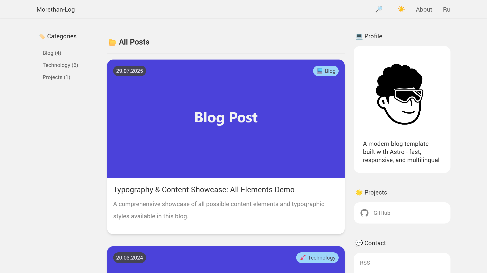

# Morethan-Log for Astro

A modern, customizable blog template built with Astro. Fast, responsive, and multilingual out of the box.

🌐 **[Live Demo](https://morethan-log-astro.sereja.com/)**



> **Inspiration:**
> I loved the original **[morethan-log](https://github.com/morethanmin/morethan-log)** Next.js template so much that I ported it to Astro for my own site, **[sereja.com](https://sereja.com/)** \- and open-sourced the result as **[morethan-log-astro](https://github.com/JustSereja/morethan-log-astro)** so fellow Astro fans can spin up a blazing-fast blog with the same clean design in seconds.

## 🚀 Features

- **🌍 Multilingual Support** - Built-in support for multiple languages (EN/RU by default)
- **📱 Responsive Design** - Looks great on all devices
- **🌙 Dark Mode** - Automatic theme switching based on system preferences
- **🔍 Search Functionality** - Built-in search for your content
- **📝 Markdown Support** - Write posts in Markdown with full syntax highlighting
- **🏷️ Categories** - Organize posts by categories
- **📊 SEO Optimized** - Meta tags, sitemap, multilingual RSS feeds included
- **⚙️ Highly Configurable** - Easy customization through single config file
- **💬 Social Links** - Add your social media profiles easily

## 📦 Quick Start

### Prerequisites

- Node.js 18+ and npm

### Installation

1. **Quick Start with npm create** (Recommended)
   
   The easiest way to get started is using the Astro CLI:
   
   ```bash
   npm create astro@latest -- --template JustSereja/morethan-log-astro
   ```
   
   This command will:
   - Prompt you for a project name
   - Create a new directory with your blog
   - Install all dependencies automatically
   
   Then navigate to your project:
   ```bash
   cd [your-project-name]
   ```

2. **Alternative: Use GitHub Template**
   
   If you prefer to create a GitHub repository first:
   
   [](https://github.com/JustSereja/morethan-log-astro/generate)
   
   Then clone and set up:
   ```bash
   git clone https://github.com/[your-username]/[your-repo-name].git
   cd [your-repo-name]
   npm install
   ```

### Running the Development Server

Start the development server:
```bash
npm run dev
```

Open your browser and visit `http://localhost:4321` to see your blog!

> `npm run dev` now handles all client-side bundles automatically—no extra watch commands needed. Edit files under `src/` and the Astro dev server takes care of the rest.

## ⚙️ Configuration

All site configuration is centralized in `src/config/site.ts` and fully typed:

```typescript
import type { SiteConfig } from '@config';

const siteConfig: SiteConfig = {
  siteUrl: 'https://morethan-log-astro.sereja.com',
  title: {
    en: 'Morethan-Log',
    ru: 'Morethan-Log',
  },
  description: {
    en: 'A modern blog template built with Astro',
    ru: 'Современный шаблон блога на Astro',
  },
  author: {
    name: {
      en: 'Sereja',
      ru: 'Серёжа',
    },
    email: 'demo@morethan-log.com',
    avatar: '/img/avatar.svg',
    bio: {
      en: 'Full-stack developer passionate about the web.',
      ru: 'Full-stack разработчик, увлеченный вебом.',
    },
  },
  // ...see the file for the complete option list
};

export default siteConfig;
```

### Social Links

Add your social media profiles:

```typescript
socialLinks: {
  en: {
    github: 'https://github.com/yourusername',
    twitter: 'https://x.com/yourusername',
  },
  ru: {
    github: 'https://github.com/yourusername-ru',
  },
}
```

### Categories

Configure blog categories:

```typescript
categories: {
  blog: {
    enabled: true,
    path: "/blog",
    icon: "💻",
    label: {
      en: 'Blog',
      ru: 'Блог',
    },
    description: {
      en: 'Personal thoughts, experiences, and insights',
      ru: 'Личные мысли, опыт и идеи',
    },
  },
  // Add more categories
}
```

### Features

Toggle features on/off:

```typescript
features: {
  darkMode: true,
  search: true,
  rss: true,
  // ... more features
}
```

### Date Formats

Control how dates render per language:

```typescript
dateFormats: {
  en: {
    locale: 'en-US',
    options: { year: 'numeric', month: 'long', day: 'numeric' },
  },
  ru: {
    locale: 'ru-RU',
    options: { year: 'numeric', month: 'long', day: 'numeric' },
  },
}
```

## 📝 Writing Posts

### Creating a New Post

1. Create a new `.md` file in the appropriate directory:
   - Blog posts: `src/content/posts/en/blog/`
   - Technology posts: `src/content/posts/en/technology/`
   - Projects: `src/content/posts/en/projects/`

2. Add frontmatter using the typed schema:

```markdown
---
title: 'Your Post Title'
h1: 'Display Title'
description: 'A brief description of your post'
date: '2024-03-15'
announcement: 'Optional summary shown in lists'
image: '/img/posts/your-image.jpg'
---

Your post content here...
```

> The folder path `src/content/posts/<lang>/<category>/` defines the language and category automatically—no extra frontmatter needed.

### Multi-language Posts

Create a matching file under `src/content/posts/ru/<category>/` with the **same file name**. The build system derives language, category, and translation keys from the folder structure automatically.

```
src/content/posts/en/blog/my-post.md   # English
src/content/posts/ru/blog/my-post.md   # Russian
```

### Language Support

The template supports both multilingual and single-language content:

- **Multilingual posts:** keep the same file name across languages so the auto-generated translation key matches.
- **Single-language posts:** create a single entry; the language switcher gracefully falls back to the homepage of other locales.

This is perfect for:
- Language-specific announcements
- Regional content
- Technical documentation in one language
- Gradual content translation

### RSS Feeds

The template provides multilingual RSS feeds with full content support:

#### Feed Structure

- **Main Feed** (`/rss.xml`) - Contains posts in the default language (English)
- **English Feed** (`/en/rss.xml`) - English posts only  
- **Russian Feed** (`/ru/rss.xml`) - Russian posts only

This approach ensures subscribers never receive content in languages they don't understand. The main feed (`/rss.xml`) serves the default language to maintain compatibility with RSS readers that expect a feed at this standard location.

#### Features

Each RSS feed includes:
- ✅ Full HTML content (not just descriptions)
- ✅ Properly converted image URLs (relative to absolute)
- ✅ Author information
- ✅ Post categories
- ✅ All required RSS 2.0 elements

#### Feed Discovery

RSS feeds are automatically linked in the `<head>` of each page:
- The main feed (`/rss.xml`) contains default language content
- Language-specific feeds are available at `/{lang}/rss.xml`
- Alternative language feeds include `hreflang` attributes

#### Customizing Default Language

To change which language appears in the main RSS feed, update `defaultLanguage` in `src/config/site.ts`:

```typescript
// src/config/site.ts
export default {
  // ...
  defaultLanguage: "ru", // Change to make Russian the main feed language
  // ...
}
```

## 🎨 Customization

### Styling

- Main styles: `public/css/style.css`
- Modify CSS variables for colors and themes
- Dark mode styles are included

### Images

#### Placeholder Images

The template includes category-specific placeholder images for posts without featured images:

- **Blog posts**: `/public/img/posts/placeholder-blog.svg` (Purple gradient with document icon)
- **Technology posts**: `/public/img/posts/placeholder-technology.svg` (Green gradient with code terminal)
- **Projects posts**: `/public/img/posts/placeholder-projects.svg` (Orange gradient with gear icon)
- **Default**: `/public/img/posts/placeholder.svg` (Simple fallback)

Posts automatically use the appropriate placeholder based on their category.

#### RSS Channel Image

For RSS feeds, the template supports both SVG and PNG formats:
- Create your logo as `/public/img/rss-logo.png` (144x144px) for best compatibility
- Falls back to `/public/img/rss-logo.svg` if PNG doesn't exist
- PNG format is recommended as it's more universally supported by RSS readers

### Adding New Languages

1. Add language to `src/i18n/ui.ts`:

```typescript
export const languages = {
  en: 'English',
  ru: 'Русский',
  es: 'Español'  // New language
};
```

2. Add translations:

```typescript
export const ui = {
  // ... existing languages
  es: {
    'name': SITE_CONFIG.author.name,
    'ui.about': 'Acerca de',
    // ... more translations
  }
}
```

### Custom Pages

Create new pages in `src/pages/` using `.astro` or `.md` files.

### Language-Specific Social Links and Author Names

The template now supports different social links and author names for each language:

1. **Language-Specific Social Links**: Configure different social media profiles for each language in `src/config/site.ts`:
   ```javascript
   socialLinks: {
     en: {
       github: "https://github.com/EnglishUsername",
       twitter: "https://x.com/EnglishHandle",
       // ... other social links
     },
     ru: {
       github: "https://github.com/RussianUsername",
       twitter: "https://x.com/RussianHandle",
       // ... other social links
     }
   }
   ```

2. **Language-Specific Author Names**: Set different author names for each language:
   ```javascript
   author: {
     name: {
       en: "John Doe",
       ru: "Иван Иванов"
     },
     // ... other author fields
   }
   ```

## 🚀 Deployment

### Build for Production

```bash
npm run build
```

## 🔄 Updating the Template

Keeping your project in sync with the upstream template is easiest when you track the original repository and selectively pull in changes.

### Recommended: use the bundled Make target

From your project root, run:

```bash
make update-template
```

This command:
- Clones the latest `main` branch of the upstream template into `.template-update`
- Syncs framework, layout, scripts, styles, and assets into your project using `rsync`
- Leaves your content (`src/content/**`), personal config (`src/config/site.ts`), and images (`public/img/**`, favicons) untouched
- Cleans up the temporary clone when finished
- Anything under `public/css/` is considered template-owned; keep personal overrides elsewhere or reapply them after the sync

Requirements:
- `git` and `rsync` installed (macOS/Linux ship with both; on Windows, use WSL or install via package manager)
- Any local changes committed or stashed so you can review the diff the command produces

After it runs, review `git status`, resolve conflicts (if any), reinstall deps when `package.json` changes, and run `npx astro sync` followed by `npm run build` to double-check everything still compiles.

### Track template releases from your project

Run the following once inside your project folder:

```bash
git remote add upstream https://github.com/JustSereja/morethan-log-astro.git
git fetch upstream --tags
```

From now on, `git fetch upstream --tags` pulls the latest commits and release tags. You can inspect what changed with `git log upstream/main`.

### Merge everything (demo content included)

If you want the full template (including demo posts and placeholder config) in your project:

```bash
git checkout main
git pull
git merge upstream/main
```

Resolve any conflicts, test the build, then commit the merge.

### Update code without demo content or placeholder config

To grab only the template code while keeping your own content and configuration, restore just the framework directories from the template branch (or a specific release tag):

```bash
# Update TAG if you prefer a specific release, e.g. upstream/v2.0.0
TARGET_REF=upstream/main

git fetch upstream --tags
git checkout main
git pull

git restore --source "$TARGET_REF" \
  astro.config.mjs \
  package.json package-lock.json \
  tsconfig.json \
  public/css public/favicon.ico public/favicon.svg public/img \
  scripts \
  src/components src/i18n src/layouts src/lib src/pages src/scripts src/utils

# keep your live content and custom site settings
git checkout -- src/content src/config/site.ts

npm install
npx astro sync
npm run build
```

This sequence:
- Brings in the latest template logic, layouts, scripts, and assets.
- Leaves `src/content/**` untouched, so your posts and pages stay intact.
- Restores your own `src/config/site.ts`, keeping personal branding, social links, and other secrets.

Review `git status`, commit the updated files, and (optionally) create a tag for the new version of your site.
